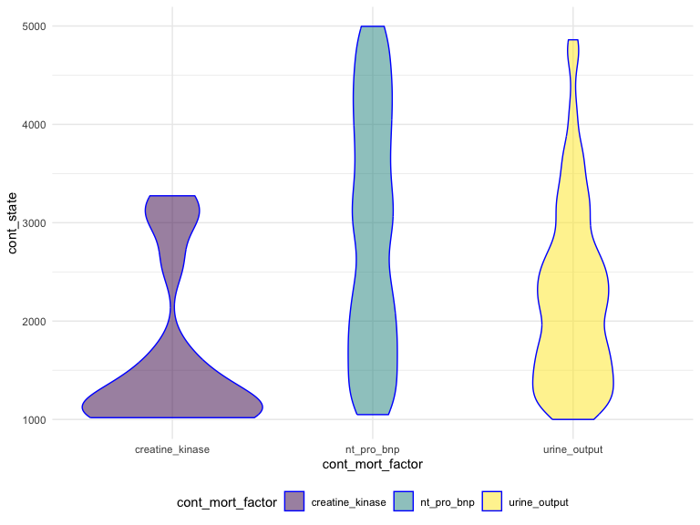
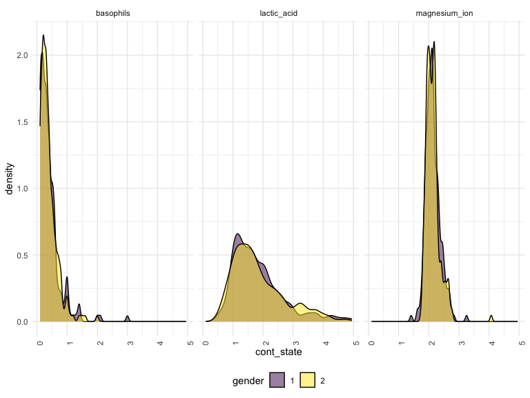

Cynthia’s_Manipulation
================
Yangyang Chen
2023-12-01

# *Pre-processing*

``` r
mort_df = 
  read_csv("data/data01.csv") |> 
  janitor::clean_names() |> 
  drop_na() |>
  pivot_longer(
   hypertensive:copd,
   names_to = "bi_mort_factor",
    values_to = "bi_state"
   ) |>
  pivot_longer(
   heart_rate:ef,
   names_to = "cont_mort_factor",
    values_to = "cont_state"
   ) |> 
  rename(gender = gendera) |> 
  mutate(
    bi_state = as.factor(bi_state),
    gender = as.factor(gender)) |> 
  arrange(id) |> 
  group_by(group)
```

    ## Rows: 1177 Columns: 51
    ## ── Column specification ──────────────────────────────────────────────────────
    ## Delimiter: ","
    ## dbl (51): group, ID, outcome, age, gendera, BMI, hypertensive, atrialfibrill...
    ## 
    ## ℹ Use `spec()` to retrieve the full column specification for this data.
    ## ℹ Specify the column types or set `show_col_types = FALSE` to quiet this message.

# *EDA*

### *scatter plot*

We could observe continuous mortality factor’s highest and lowest values
in each gender by fixing abnormal range:

``` r
mort_df |>  
  filter(cont_state >= 40, cont_state <= 50) |> 
  ggplot(aes(x = cont_mort_factor, y = cont_state, color = gender, shape = gender)) + 
  geom_point(alpha = .75) +
  theme(axis.text.x = element_text(angle = 90, hjust = 1))
```


### *viridis plot*

Three highest continuous mortality factor in a fixed range

``` r
mort_df |>
  filter(cont_mort_factor %in% c("creatine_kinase", "nt_pro_bnp", "urine_output")) |> 
  filter(cont_state >= 1000, cont_state <= 5000) |> 
  mutate(cont_mort_factor = forcats::fct_relevel(cont_mort_factor)) |> 
  ggplot(aes(x = cont_mort_factor, y = cont_state)) + 
  geom_violin(aes(fill = cont_mort_factor), color = "blue", alpha = .5) 
```



### *density plot*

``` r
mort_df |>
  filter(cont_mort_factor %in% c("lactic_acid", "magnesium_ion", "basophils")) |> 
  filter(cont_state >= 0, cont_state <= 5) |> 
  select(cont_mort_factor, cont_state, gender) |> 
  ggplot(aes(x = cont_state, fill = gender)) +
  geom_density(alpha = .5) + 
  facet_grid(~cont_mort_factor) + 
  viridis::scale_fill_viridis(discrete = TRUE) +
  theme(axis.text.x = element_text(angle = 90, hjust = 1))
```

    ## Adding missing grouping variables: `group`



### *violin plot*

``` r
mort_df |> 
  filter(cont_mort_factor %in% c("lactic_acid", "magnesium_ion", "basophils")) |> 
  filter(cont_state >= 0, cont_state <= 5) |> 
  filter(bi_mort_factor %in% c("hyperlipemia", "hypertensive", "atrialfibrillation", "chd_with_no_mi")) |> 
  select(outcome, bi_mort_factor, bi_state, cont_mort_factor, cont_state) |> 
  ggplot(aes(x = cont_mort_factor, y = cont_state)) + 
  geom_violin() + 
  facet_grid(outcome ~ bi_mort_factor)+
  theme(axis.text.x = element_text(angle = 90, hjust = 1))
```

    ## Adding missing grouping variables: `group`


