Felix_EDA
================
Yifei Liu
2023/11/25

``` r
library(tidyverse)
library(modelr)
library(purrr)
library(corrplot)
```

    ## Warning: 程辑包'corrplot'是用R版本4.3.2 来建造的

``` r
library(FactoMineR)
```

    ## Warning: 程辑包'FactoMineR'是用R版本4.3.2 来建造的

``` r
library(factoextra)
```

    ## Warning: 程辑包'factoextra'是用R版本4.3.2 来建造的

``` r
#load mortality dataset
mort_data =
  read_csv("mortality_data_cleaned.csv") |> 
  janitor::clean_names() |>
  select(-group, everything())
```

    ## Rows: 1176 Columns: 51
    ## ── Column specification ────────────────────────────────────────────────────────
    ## Delimiter: ","
    ## dbl (51): group, id, outcome, age, gender, bmi, hypertensive, atrialfibrilla...
    ## 
    ## ℹ Use `spec()` to retrieve the full column specification for this data.
    ## ℹ Specify the column types or set `show_col_types = FALSE` to quiet this message.

``` r
#select patient outcome and complications
com_data =
  mort_data |>
  select(outcome, hypertensive:copd)
#show correlation
corrplot(cor(com_data), type = "upper", diag = FALSE)
```

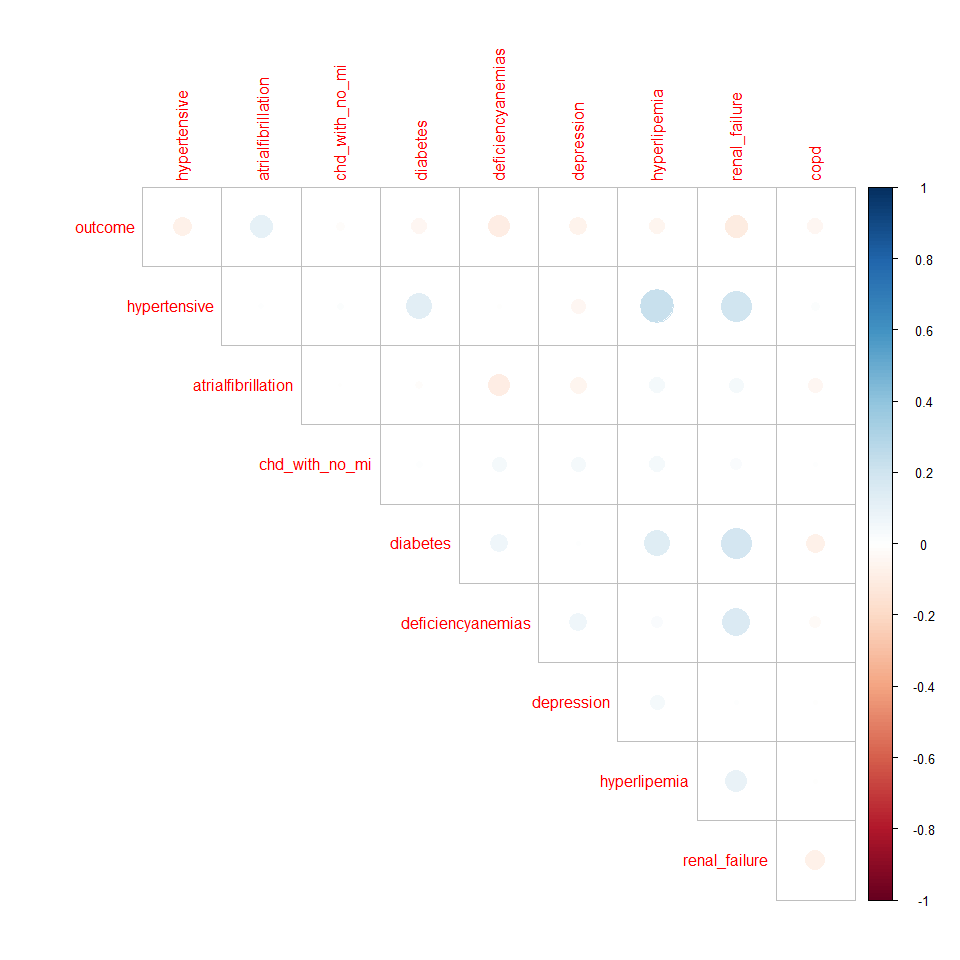<!-- -->

Interpretation:  
- `outcome` seems strongly connected with `deficiencyanemias`,
`renal_failure`.  - `hypertensive` shows strong correlation with
`hyperlipemia` and `renal_failure`.  
- `diabetes` shows strong correlation with `renal_failure`.  
- `hyperlipemia` also shows strong correlation with `renal_failure`.  

``` r
#select patient outcome and vital signs
sign_data =
  mort_data |>
  select(outcome, heart_rate:ef)
#show correlation
corrplot(cor(sign_data), type = "upper", diag = FALSE)
```

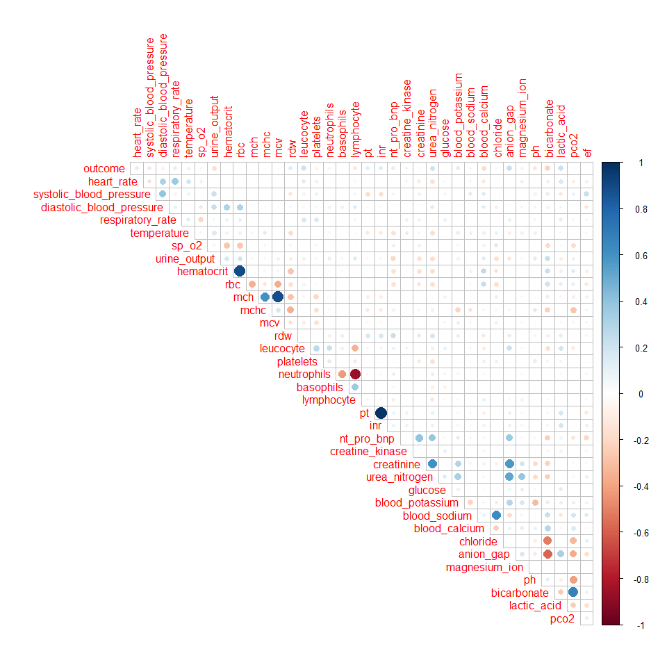<!-- -->

``` r
#linear model for complications
model_com = glm(outcome ~ ., data = com_data)
summary(model_com)
```

    ## 
    ## Call:
    ## glm(formula = outcome ~ ., data = com_data)
    ## 
    ## Coefficients:
    ##                    Estimate Std. Error t value Pr(>|t|)    
    ## (Intercept)         0.19967    0.02384   8.375  < 2e-16 ***
    ## hypertensive       -0.03630    0.02288  -1.586  0.11295    
    ## atrialfibrillation  0.06474    0.01995   3.245  0.00121 ** 
    ## chd_with_no_mi     -0.00497    0.03515  -0.141  0.88759    
    ## diabetes           -0.01438    0.02051  -0.701  0.48351    
    ## deficiencyanemias  -0.05271    0.02118  -2.488  0.01298 *  
    ## depression         -0.05380    0.03053  -1.762  0.07829 .  
    ## hyperlipemia       -0.02237    0.02099  -1.066  0.28672    
    ## renal_failure      -0.06352    0.02142  -2.965  0.00308 ** 
    ## copd               -0.06873    0.03738  -1.839  0.06621 .  
    ## ---
    ## Signif. codes:  0 '***' 0.001 '**' 0.01 '*' 0.05 '.' 0.1 ' ' 1
    ## 
    ## (Dispersion parameter for gaussian family taken to be 0.1134037)
    ## 
    ##     Null deviance: 137.50  on 1175  degrees of freedom
    ## Residual deviance: 132.23  on 1166  degrees of freedom
    ## AIC: 789.38
    ## 
    ## Number of Fisher Scoring iterations: 2

``` r
model_com_se = lm(outcome ~ ., data = com_data) |>
  step(direction = "both", trace = FALSE)
summary(model_com_se)
```

    ## 
    ## Call:
    ## lm(formula = outcome ~ hypertensive + atrialfibrillation + deficiencyanemias + 
    ##     depression + renal_failure + copd, data = com_data)
    ## 
    ## Residuals:
    ##      Min       1Q   Median       3Q      Max 
    ## -0.25569 -0.15866 -0.12482 -0.06886  0.97537 
    ## 
    ## Coefficients:
    ##                    Estimate Std. Error t value Pr(>|t|)    
    ## (Intercept)         0.19180    0.02285   8.394  < 2e-16 ***
    ## hypertensive       -0.04319    0.02227  -1.939  0.05269 .  
    ## atrialfibrillation  0.06390    0.01991   3.210  0.00136 ** 
    ## deficiencyanemias  -0.05385    0.02114  -2.547  0.01099 *  
    ## depression         -0.05589    0.03044  -1.836  0.06662 .  
    ## renal_failure      -0.06704    0.02113  -3.172  0.00155 ** 
    ## copd               -0.06698    0.03728  -1.797  0.07264 .  
    ## ---
    ## Signif. codes:  0 '***' 0.001 '**' 0.01 '*' 0.05 '.' 0.1 ' ' 1
    ## 
    ## Residual standard error: 0.3366 on 1169 degrees of freedom
    ## Multiple R-squared:  0.03684,    Adjusted R-squared:  0.0319 
    ## F-statistic: 7.453 on 6 and 1169 DF,  p-value: 7.536e-08

``` r
#generalized linear model for complications
model_com_glm = glm(outcome ~ ., data = com_data)
summary(model_com_glm)
```

    ## 
    ## Call:
    ## glm(formula = outcome ~ ., data = com_data)
    ## 
    ## Coefficients:
    ##                    Estimate Std. Error t value Pr(>|t|)    
    ## (Intercept)         0.19967    0.02384   8.375  < 2e-16 ***
    ## hypertensive       -0.03630    0.02288  -1.586  0.11295    
    ## atrialfibrillation  0.06474    0.01995   3.245  0.00121 ** 
    ## chd_with_no_mi     -0.00497    0.03515  -0.141  0.88759    
    ## diabetes           -0.01438    0.02051  -0.701  0.48351    
    ## deficiencyanemias  -0.05271    0.02118  -2.488  0.01298 *  
    ## depression         -0.05380    0.03053  -1.762  0.07829 .  
    ## hyperlipemia       -0.02237    0.02099  -1.066  0.28672    
    ## renal_failure      -0.06352    0.02142  -2.965  0.00308 ** 
    ## copd               -0.06873    0.03738  -1.839  0.06621 .  
    ## ---
    ## Signif. codes:  0 '***' 0.001 '**' 0.01 '*' 0.05 '.' 0.1 ' ' 1
    ## 
    ## (Dispersion parameter for gaussian family taken to be 0.1134037)
    ## 
    ##     Null deviance: 137.50  on 1175  degrees of freedom
    ## Residual deviance: 132.23  on 1166  degrees of freedom
    ## AIC: 789.38
    ## 
    ## Number of Fisher Scoring iterations: 2

``` r
model_com_glm_se = glm(outcome ~ ., data = com_data) |>
  step(direction = "both", trace = FALSE)
summary(model_com_glm_se)
```

    ## 
    ## Call:
    ## glm(formula = outcome ~ hypertensive + atrialfibrillation + deficiencyanemias + 
    ##     depression + renal_failure + copd, data = com_data)
    ## 
    ## Coefficients:
    ##                    Estimate Std. Error t value Pr(>|t|)    
    ## (Intercept)         0.19180    0.02285   8.394  < 2e-16 ***
    ## hypertensive       -0.04319    0.02227  -1.939  0.05269 .  
    ## atrialfibrillation  0.06390    0.01991   3.210  0.00136 ** 
    ## deficiencyanemias  -0.05385    0.02114  -2.547  0.01099 *  
    ## depression         -0.05589    0.03044  -1.836  0.06662 .  
    ## renal_failure      -0.06704    0.02113  -3.172  0.00155 ** 
    ## copd               -0.06698    0.03728  -1.797  0.07264 .  
    ## ---
    ## Signif. codes:  0 '***' 0.001 '**' 0.01 '*' 0.05 '.' 0.1 ' ' 1
    ## 
    ## (Dispersion parameter for gaussian family taken to be 0.1132904)
    ## 
    ##     Null deviance: 137.50  on 1175  degrees of freedom
    ## Residual deviance: 132.44  on 1169  degrees of freedom
    ## AIC: 785.23
    ## 
    ## Number of Fisher Scoring iterations: 2

``` r
#linear model for vital signs
model_sign = lm(outcome ~ ., data = sign_data)
summary(model_sign)
```

    ## 
    ## Call:
    ## lm(formula = outcome ~ ., data = sign_data)
    ## 
    ## Residuals:
    ##      Min       1Q   Median       3Q      Max 
    ## -0.72774 -0.16758 -0.07108  0.03559  1.10825 
    ## 
    ## Coefficients:
    ##                            Estimate Std. Error t value Pr(>|t|)    
    ## (Intercept)               1.784e+00  3.248e+00   0.549 0.583009    
    ## heart_rate                2.421e-03  7.026e-04   3.446 0.000590 ***
    ## systolic_blood_pressure   5.076e-04  6.658e-04   0.762 0.445982    
    ## diastolic_blood_pressure -2.362e-03  1.145e-03  -2.064 0.039261 *  
    ## respiratory_rate          4.120e-03  2.543e-03   1.620 0.105529    
    ## temperature              -2.948e-02  1.652e-02  -1.785 0.074510 .  
    ## sp_o2                    -8.904e-03  4.284e-03  -2.079 0.037880 *  
    ## urine_output             -1.819e-05  7.982e-06  -2.279 0.022844 *  
    ## hematocrit               -4.421e-03  1.582e-02  -0.279 0.779964    
    ## rbc                       5.951e-02  1.394e-01   0.427 0.669481    
    ## mch                       3.190e-02  8.619e-02   0.370 0.711394    
    ## mchc                     -3.267e-02  7.635e-02  -0.428 0.668774    
    ## mcv                      -6.003e-03  2.970e-02  -0.202 0.839830    
    ## rdw                       8.326e-03  5.259e-03   1.583 0.113678    
    ## leucocyte                 6.360e-03  2.056e-03   3.094 0.002025 ** 
    ## platelets                -3.026e-04  9.226e-05  -3.280 0.001071 ** 
    ## neutrophils              -8.144e-04  1.772e-03  -0.460 0.645832    
    ## basophils                 1.029e-02  2.437e-02   0.422 0.672868    
    ## lymphocyte               -2.538e-03  2.294e-03  -1.107 0.268647    
    ## pt                       -5.108e-03  7.679e-03  -0.665 0.506085    
    ## inr                       6.917e-02  6.772e-02   1.021 0.307250    
    ## nt_pro_bnp                2.848e-07  8.145e-07   0.350 0.726660    
    ## creatine_kinase           6.313e-06  6.663e-06   0.948 0.343577    
    ## creatinine               -4.355e-02  1.062e-02  -4.099 4.44e-05 ***
    ## urea_nitrogen             2.134e-03  6.452e-04   3.308 0.000971 ***
    ## glucose                  -1.654e-04  1.854e-04  -0.892 0.372605    
    ## blood_potassium           5.361e-02  4.051e-02   1.323 0.186024    
    ## blood_sodium              1.541e-02  3.033e-02   0.508 0.611576    
    ## blood_calcium            -8.210e-02  1.838e-02  -4.466 8.74e-06 ***
    ## chloride                 -1.646e-02  3.050e-02  -0.540 0.589599    
    ## anion_gap                 3.552e-03  3.076e-02   0.115 0.908095    
    ## magnesium_ion             2.258e-02  4.012e-02   0.563 0.573606    
    ## ph                        1.272e-01  2.255e-01   0.564 0.572975    
    ## bicarbonate              -2.469e-02  3.060e-02  -0.807 0.420081    
    ## lactic_acid               3.660e-02  1.223e-02   2.992 0.002833 ** 
    ## pco2                      4.588e-03  1.589e-03   2.888 0.003948 ** 
    ## ef                        8.004e-04  7.797e-04   1.027 0.304871    
    ## ---
    ## Signif. codes:  0 '***' 0.001 '**' 0.01 '*' 0.05 '.' 0.1 ' ' 1
    ## 
    ## Residual standard error: 0.3056 on 1139 degrees of freedom
    ## Multiple R-squared:  0.2264, Adjusted R-squared:  0.202 
    ## F-statistic: 9.261 on 36 and 1139 DF,  p-value: < 2.2e-16

``` r
model_sign_se = lm(outcome ~ ., data = sign_data) |>
  step(direction = "both", trace = FALSE)
summary(model_sign_se)
```

    ## 
    ## Call:
    ## lm(formula = outcome ~ heart_rate + diastolic_blood_pressure + 
    ##     respiratory_rate + temperature + sp_o2 + urine_output + rdw + 
    ##     leucocyte + platelets + inr + creatinine + urea_nitrogen + 
    ##     blood_potassium + blood_sodium + blood_calcium + chloride + 
    ##     bicarbonate + lactic_acid + pco2 + mcv, data = sign_data)
    ## 
    ## Residuals:
    ##      Min       1Q   Median       3Q      Max 
    ## -0.77023 -0.16761 -0.07124  0.03252  1.09832 
    ## 
    ## Coefficients:
    ##                            Estimate Std. Error t value Pr(>|t|)    
    ## (Intercept)               1.894e+00  8.098e-01   2.339 0.019510 *  
    ## heart_rate                2.254e-03  6.606e-04   3.412 0.000666 ***
    ## diastolic_blood_pressure -1.954e-03  9.410e-04  -2.076 0.038114 *  
    ## respiratory_rate          4.167e-03  2.520e-03   1.653 0.098520 .  
    ## temperature              -2.916e-02  1.606e-02  -1.816 0.069706 .  
    ## sp_o2                    -1.030e-02  4.167e-03  -2.471 0.013603 *  
    ## urine_output             -1.819e-05  7.780e-06  -2.338 0.019556 *  
    ## rdw                       8.575e-03  4.506e-03   1.903 0.057290 .  
    ## leucocyte                 7.475e-03  1.909e-03   3.916 9.54e-05 ***
    ## platelets                -2.872e-04  8.724e-05  -3.293 0.001022 ** 
    ## inr                       2.609e-02  1.118e-02   2.334 0.019745 *  
    ## creatinine               -4.261e-02  1.015e-02  -4.199 2.89e-05 ***
    ## urea_nitrogen             2.159e-03  5.812e-04   3.715 0.000213 ***
    ## blood_potassium           5.712e-02  2.518e-02   2.268 0.023500 *  
    ## blood_sodium              1.994e-02  6.383e-03   3.123 0.001833 ** 
    ## blood_calcium            -8.049e-02  1.791e-02  -4.494 7.71e-06 ***
    ## chloride                 -2.022e-02  5.913e-03  -3.420 0.000647 ***
    ## bicarbonate              -2.714e-02  5.267e-03  -5.154 3.00e-07 ***
    ## lactic_acid               3.424e-02  1.175e-02   2.915 0.003626 ** 
    ## pco2                      4.156e-03  1.180e-03   3.522 0.000444 ***
    ## mcv                       2.225e-03  1.423e-03   1.564 0.118149    
    ## ---
    ## Signif. codes:  0 '***' 0.001 '**' 0.01 '*' 0.05 '.' 0.1 ' ' 1
    ## 
    ## Residual standard error: 0.3047 on 1155 degrees of freedom
    ## Multiple R-squared:  0.2203, Adjusted R-squared:  0.2068 
    ## F-statistic: 16.32 on 20 and 1155 DF,  p-value: < 2.2e-16

``` r
#cross-validation for complications
cv_com =
  modelr::crossv_mc(com_data, 10)

cv_com_rmse =
  cv_com |>
  mutate(
    lm_cv_com = map(cv_com$train, 
                         \(df) lm(outcome ~ ., data = (df)) |>
                           step(direction = "both", trace = FALSE)),
    glm_cv_com = map(cv_com$train, 
                         \(df) glm(outcome ~ ., data = (df)) |>
                           step(direction = "both", trace = FALSE)),
    lm_cv_pca1 = map(cv_com$train, 
                         \(df) glm(outcome ~ renal_failure + hypertensive + diabetes + hyperlipemia, data = (df))),
    lm_cv_pca2 = map(cv_com$train, 
                         \(df) glm(outcome ~ chd_with_no_mi + depression + copd + atrialfibrillation, data = (df)))
  ) |>
  mutate(
    errs_lm_com = purrr::map2_dbl(lm_cv_com, cv_com$test, rmse),
    errs_glm_com = purrr::map2_dbl(glm_cv_com, cv_com$test, rmse),
    errs_pca1 = purrr::map2_dbl(lm_cv_pca1, cv_com$test, rmse),
    errs_pca2 = purrr::map2_dbl(lm_cv_pca2, cv_com$test, rmse)
  )

cv_com_rmse |>
  select(lm_com = errs_lm_com,
         glm_com = errs_glm_com,
         lm_pca1 = errs_pca1,
         lm_pca2 = errs_pca2) |>
  pivot_longer(everything(), 
               names_to = "models",
               values_to = "rmse") |>
  mutate(model = factor(models, levels = c("lm_com", "glm_com", "lm_pca1", "lm_pca2"))) |>
  ggplot(aes(x = model, y = rmse)) +
  geom_violin() +
  labs(x = "Models", y = "rmse", title = "Cross-Validated Prediction Error") +
  theme_minimal()
```

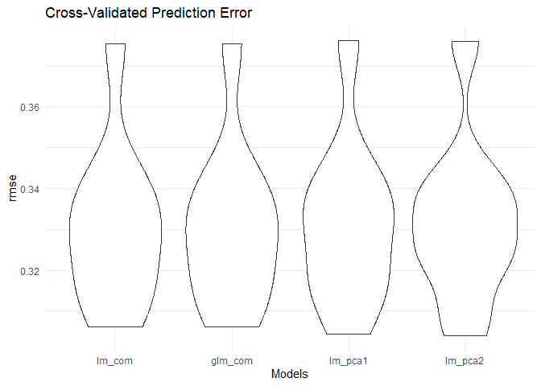<!-- -->

``` r
#pca for complications
com_names = 
  com_data |>
  select(hypertensive:copd) |>
  colnames()

#pca using R build-in function prcomp()
vars_com = com_data[, com_names]
pca_res_com = prcomp(vars_com, scale. = TRUE)
summary(pca_res_com)
```

    ## Importance of components:
    ##                           PC1    PC2    PC3    PC4    PC5    PC6     PC7
    ## Standard deviation     1.2376 1.0842 1.0339 1.0087 0.9773 0.9503 0.92110
    ## Proportion of Variance 0.1702 0.1306 0.1188 0.1130 0.1061 0.1003 0.09427
    ## Cumulative Proportion  0.1702 0.3008 0.4196 0.5326 0.6387 0.7391 0.83333
    ##                            PC8     PC9
    ## Standard deviation     0.90240 0.82808
    ## Proportion of Variance 0.09048 0.07619
    ## Cumulative Proportion  0.92381 1.00000

``` r
#pca using packages `FactoMineR`, `factoextra`
com = com_data |> select(-outcome)
res_pca_com = PCA(com, scale.unit = TRUE, graph = TRUE)
```

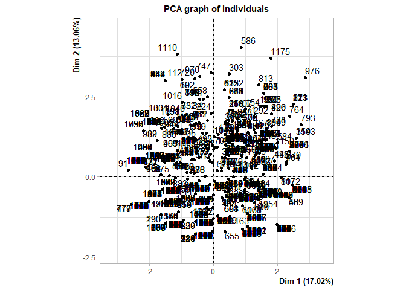<!-- -->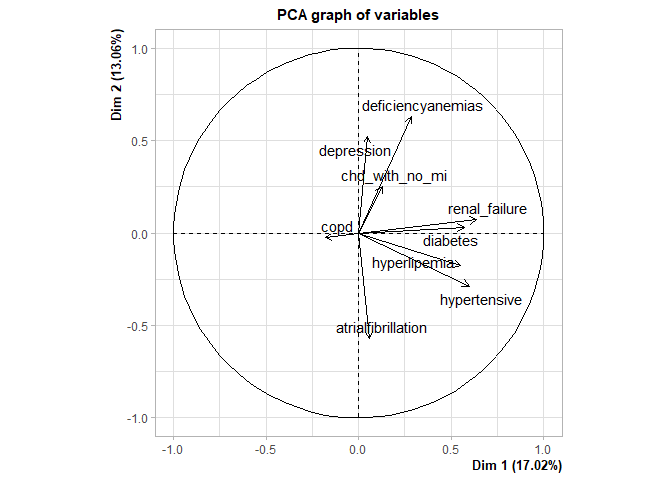<!-- -->

``` r
#PCA() function would do the data standardization automatically.
#keep 5 dimensions as result.

get_eigenvalue(res_pca_com)
```

    ##       eigenvalue variance.percent cumulative.variance.percent
    ## Dim.1  1.5316254        17.018060                    17.01806
    ## Dim.2  1.1753995        13.059995                    30.07806
    ## Dim.3  1.0690383        11.878203                    41.95626
    ## Dim.4  1.0174731        11.305256                    53.26151
    ## Dim.5  0.9550191        10.611323                    63.87284
    ## Dim.6  0.9029764        10.033071                    73.90591
    ## Dim.7  0.8484242         9.426936                    83.33285
    ## Dim.8  0.8143218         9.048020                    92.38087
    ## Dim.9  0.6857221         7.619135                   100.00000

``` r
#`variance.percent` explains the percentage of change. 70% would be adequate.

#scree plot
fviz_eig(res_pca_com, addlabels = TRUE, ylim = c(0, 20))
```

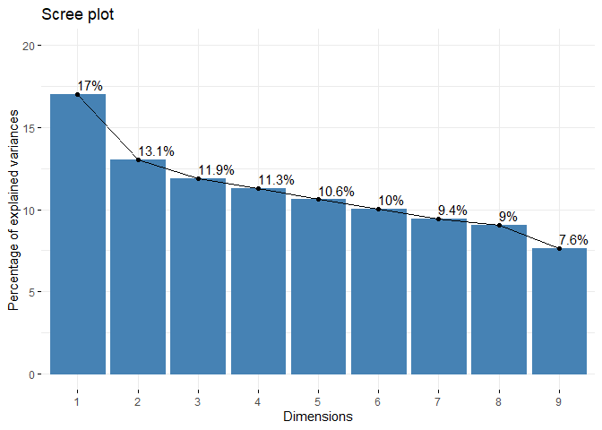<!-- -->

``` r
#visualize the contributions of each dimension.

#result
var_com <- get_pca_var(res_pca_com) 
var_com$coord
```

    ##                          Dim.1       Dim.2      Dim.3       Dim.4        Dim.5
    ## hypertensive        0.59708519 -0.28721816  0.3238048 -0.17560570 -0.002410033
    ## atrialfibrillation  0.06085441 -0.57034997 -0.2552078  0.49189450  0.059405646
    ## chd_with_no_mi      0.12773038  0.25188788  0.2687708  0.65633947  0.558824069
    ## diabetes            0.57008318  0.03205436 -0.1663287 -0.13044836 -0.125516848
    ## deficiencyanemias   0.28454746  0.62833937 -0.1657905 -0.16370330  0.274195018
    ## depression          0.04763546  0.52069722  0.1793478  0.38977049 -0.633452415
    ## hyperlipemia        0.55345158 -0.17725683  0.3788382  0.18157445 -0.254981439
    ## renal_failure       0.63863988  0.07111536 -0.2441543 -0.08964874  0.200730205
    ## copd               -0.18081936 -0.02679237  0.7323749 -0.27776116  0.204187209

``` r
#shown by correlation

fviz_pca_var(res_pca_com, col.var = "contrib", gradient.cols = c("#00AFBB", "#E7B800", "#FC4E07"))
```

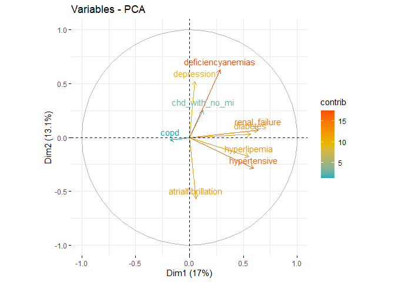<!-- -->

``` r
#based on above results (`var_com$coord`)
#basically,
#(a) positive correlated variables are grouped together,
#(b) negative correlated variables are located on opposite sides of the origin,
#(c) the distance between the variable and the origin measures the quality of the variable. Variables that are far from the origin are well represented.

corrplot(var_com$cos2, is.corr=FALSE)
```

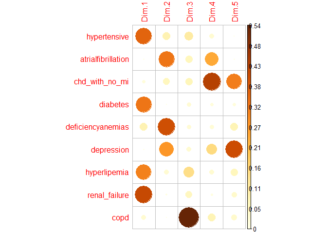<!-- -->

``` r
#shows the quality of variables.

var_com$contrib
```

    ##                         Dim.1       Dim.2     Dim.3      Dim.4        Dim.5
    ## hypertensive       23.2766257  7.01840267  9.807839  3.0307791 6.081824e-04
    ## atrialfibrillation  0.2417862 27.67561860  6.092487 23.7805013 3.695246e-01
    ## chd_with_no_mi      1.0652115  5.39795229  6.757264 42.3383683 3.269928e+01
    ## diabetes           21.2189500  0.08741558  2.587861  1.6724546 1.649651e+00
    ## deficiencyanemias   5.2863614 33.58946121  2.571143  2.6338556 7.872398e+00
    ## depression          0.1481522 23.06667586  3.008837 14.9312093 4.201612e+01
    ## hyperlipemia       19.9989268  2.67313235 13.424999  3.2403099 6.807773e+00
    ## renal_failure      26.6292841  0.43027019  5.576162  0.7898878 4.219038e+00
    ## copd                2.1347020  0.06107125 50.173408  7.5826341 4.365611e+00

``` r
#shown by contribution

fviz_contrib(res_pca_com, choice = "var", axes = 1, top = 10)
```

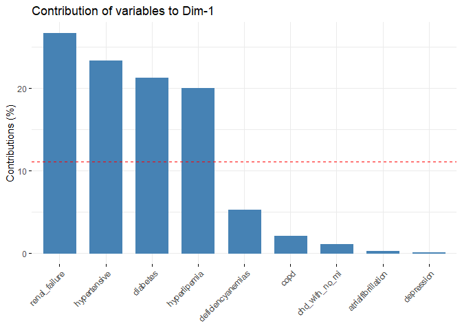<!-- -->

``` r
fviz_contrib(res_pca_com, choice = "var", axes = 1:5, top = 10)
```

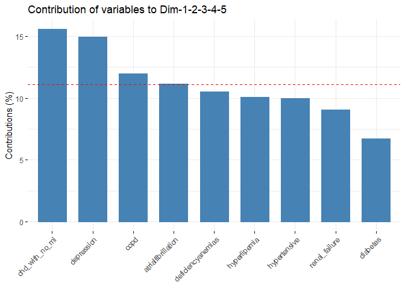<!-- -->

``` r
#pca for vital signs
sign_names = 
  sign_data |>
  select(heart_rate:ef) |>
  colnames()

#pca using R build-in function prcomp()
vars_sign = sign_data[, sign_names]
pca_res_sign = prcomp(vars_sign, scale. = TRUE)
summary(pca_res_sign)
```

    ## Importance of components:
    ##                           PC1     PC2     PC3     PC4     PC5     PC6     PC7
    ## Standard deviation     1.9704 1.75519 1.58788 1.53481 1.48901 1.40515 1.30262
    ## Proportion of Variance 0.1078 0.08557 0.07004 0.06543 0.06159 0.05485 0.04713
    ## Cumulative Proportion  0.1078 0.19342 0.26346 0.32889 0.39048 0.44532 0.49246
    ##                            PC8     PC9    PC10    PC11    PC12    PC13    PC14
    ## Standard deviation     1.25500 1.18055 1.12159 1.08514 1.06435 1.01906 0.98288
    ## Proportion of Variance 0.04375 0.03871 0.03494 0.03271 0.03147 0.02885 0.02683
    ## Cumulative Proportion  0.53621 0.57492 0.60986 0.64257 0.67404 0.70289 0.72972
    ##                           PC15    PC16   PC17    PC18   PC19    PC20    PC21
    ## Standard deviation     0.94975 0.93029 0.9059 0.87727 0.8633 0.83018 0.81972
    ## Proportion of Variance 0.02506 0.02404 0.0228 0.02138 0.0207 0.01914 0.01867
    ## Cumulative Proportion  0.75478 0.77882 0.8016 0.82299 0.8437 0.86284 0.88151
    ##                           PC22    PC23    PC24    PC25    PC26    PC27   PC28
    ## Standard deviation     0.78710 0.77189 0.73835 0.71059 0.69022 0.63136 0.5500
    ## Proportion of Variance 0.01721 0.01655 0.01514 0.01403 0.01323 0.01107 0.0084
    ## Cumulative Proportion  0.89871 0.91527 0.93041 0.94443 0.95767 0.96874 0.9771
    ##                           PC29    PC30    PC31    PC32    PC33    PC34    PC35
    ## Standard deviation     0.53262 0.49727 0.38231 0.35390 0.11283 0.07647 0.03288
    ## Proportion of Variance 0.00788 0.00687 0.00406 0.00348 0.00035 0.00016 0.00003
    ## Cumulative Proportion  0.98502 0.99189 0.99595 0.99943 0.99979 0.99995 0.99998
    ##                           PC36
    ## Standard deviation     0.02807
    ## Proportion of Variance 0.00002
    ## Cumulative Proportion  1.00000

``` r
#pca using packages `FactoMineR`, `factoextra`
sign = sign_data |> select(-outcome)
res_pca_sign = PCA(sign, scale.unit = TRUE, graph = TRUE)
```

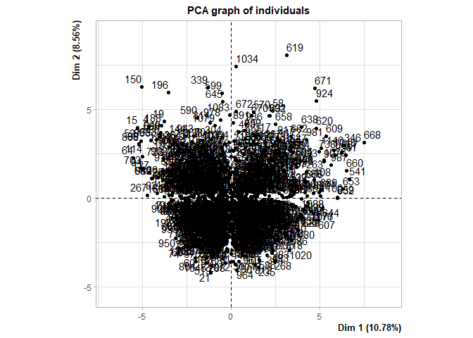<!-- -->

    ## Warning: ggrepel: 11 unlabeled data points (too many overlaps). Consider
    ## increasing max.overlaps

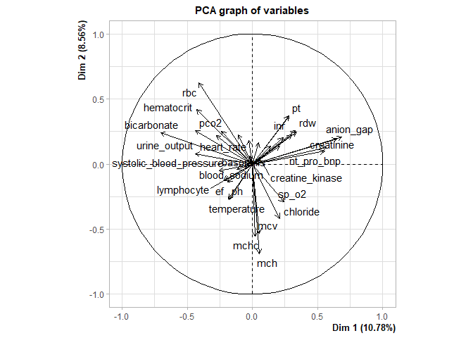<!-- -->

``` r
#PCA() function would do the data standardization automatically.
#keep 5 dimensions as result.

get_eigenvalue(res_pca_sign)
```

    ##          eigenvalue variance.percent cumulative.variance.percent
    ## Dim.1  3.8823383058     10.784273072                    10.78427
    ## Dim.2  3.0806929385      8.557480385                    19.34175
    ## Dim.3  2.5213605846      7.003779402                    26.34553
    ## Dim.4  2.3556330047      6.543425013                    32.88896
    ## Dim.5  2.2171588093      6.158774470                    39.04773
    ## Dim.6  1.9744560329      5.484600091                    44.53233
    ## Dim.7  1.6968202108      4.713389474                    49.24572
    ## Dim.8  1.5750125846      4.375034957                    53.62076
    ## Dim.9  1.3937018264      3.871393962                    57.49215
    ## Dim.10 1.2579643101      3.494345306                    60.98650
    ## Dim.11 1.1775311390      3.270919831                    64.25742
    ## Dim.12 1.1328467937      3.146796649                    67.40421
    ## Dim.13 1.0384849030      2.884680286                    70.28889
    ## Dim.14 0.9660455818      2.683459950                    72.97235
    ## Dim.15 0.9020277951      2.505632764                    75.47799
    ## Dim.16 0.8654315803      2.403976612                    77.88196
    ## Dim.17 0.8207039312      2.279733142                    80.16170
    ## Dim.18 0.7696050551      2.137791820                    82.29949
    ## Dim.19 0.7452352298      2.070097860                    84.36959
    ## Dim.20 0.6892066565      1.914462935                    86.28405
    ## Dim.21 0.6719476581      1.866521273                    88.15057
    ## Dim.22 0.6195214896      1.720893027                    89.87146
    ## Dim.23 0.5958147476      1.655040966                    91.52650
    ## Dim.24 0.5451543521      1.514317645                    93.04082
    ## Dim.25 0.5049433524      1.402620423                    94.44344
    ## Dim.26 0.4763982493      1.323328470                    95.76677
    ## Dim.27 0.3986187827      1.107274396                    96.87404
    ## Dim.28 0.3025340700      0.840372417                    97.71442
    ## Dim.29 0.2836820804      0.788005779                    98.50242
    ## Dim.30 0.2472778493      0.686882915                    99.18931
    ## Dim.31 0.1461572492      0.405992359                    99.59530
    ## Dim.32 0.1252456966      0.347904713                    99.94320
    ## Dim.33 0.0127299486      0.035360968                    99.97856
    ## Dim.34 0.0058484104      0.016245584                    99.99481
    ## Dim.35 0.0010810096      0.003002805                    99.99781
    ## Dim.36 0.0007877808      0.002188280                   100.00000

``` r
#`variance.percent` explains the percentage of change. 70% would be adequate.

#scree plot
fviz_eig(res_pca_sign, addlabels = TRUE, ylim = c(0, 20))
```

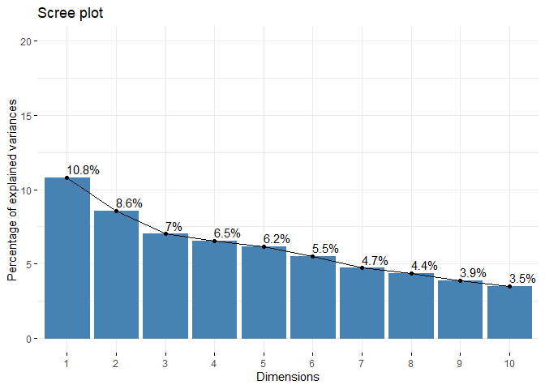<!-- -->

``` r
#visualize the contributions of each dimension.

#result
var_sign <- get_pca_var(res_pca_sign) 
var_sign$coord
```

    ##                                Dim.1       Dim.2        Dim.3         Dim.4
    ## heart_rate               -0.02246391  0.06090055 -0.392530078  0.3260299099
    ## systolic_blood_pressure  -0.25558121 -0.05105447  0.190220573  0.0339117783
    ## diastolic_blood_pressure -0.27807267  0.21786491  0.015124638  0.4552871695
    ## respiratory_rate         -0.02763299  0.17948997 -0.335546928  0.2666654389
    ## temperature              -0.18072057 -0.27190713 -0.205912393  0.1346234947
    ## sp_o2                     0.24003019 -0.29155170  0.031909909 -0.0507796416
    ## urine_output             -0.43725294  0.08103086  0.035063741  0.2143190027
    ## hematocrit               -0.42569719  0.41664045 -0.026923947  0.3389792493
    ## rbc                      -0.41236767  0.62385055 -0.112910279  0.3028089891
    ## mch                       0.05403986 -0.69027140  0.087386790  0.1799180887
    ## mchc                      0.02280423 -0.55392227 -0.141009442  0.3404398098
    ## mcv                       0.05441586 -0.53454171  0.191828591  0.0233207116
    ## rdw                       0.33744043  0.24411938  0.119197478 -0.1538592625
    ## leucocyte                 0.23464198  0.20181966 -0.461443491 -0.0004189803
    ## platelets                -0.10757415  0.22695636 -0.279416696 -0.0867225624
    ## neutrophils               0.14259222  0.13892791 -0.528725108 -0.5006385025
    ## basophils                -0.11938196 -0.04007822  0.320882887  0.3481866648
    ## lymphocyte               -0.22076603 -0.12632259  0.550206151  0.4794449340
    ## pt                        0.28056540  0.37190432 -0.164753737 -0.0620408227
    ## inr                       0.27891688  0.36767643 -0.155407858 -0.0650790475
    ## nt_pro_bnp                0.55398080  0.09778268  0.116276389 -0.0076213419
    ## creatine_kinase           0.06682307  0.03142546 -0.141177532  0.1100149869
    ## creatinine                0.56966024  0.12568562  0.447903822  0.0368800105
    ## urea_nitrogen             0.65085503  0.19179569  0.341940637 -0.1333378983
    ## glucose                   0.04827023  0.16247097 -0.047026877  0.0240938819
    ## blood_potassium           0.33166568  0.25633318  0.378786579  0.0297641095
    ## blood_sodium             -0.20887997 -0.12909590 -0.008583072 -0.2970508521
    ## blood_calcium            -0.23599460  0.25204149  0.318971662  0.0788230726
    ## chloride                  0.20849506 -0.41635980 -0.251276306 -0.0627482140
    ## anion_gap                 0.68628769  0.20587355  0.097193294  0.3828988134
    ## magnesium_ion             0.20783582  0.13658310  0.207283011 -0.0803755041
    ## ph                       -0.18913475 -0.13867178 -0.293603511  0.1718440184
    ## bicarbonate              -0.70503334  0.23884302  0.230432292 -0.3656182777
    ## lactic_acid               0.30401696  0.22495752 -0.195277022  0.3926850463
    ## pco2                     -0.43693715  0.25760703  0.403227259 -0.4653029646
    ## ef                       -0.18434007 -0.26854157 -0.002609225 -0.2976239513
    ##                                Dim.5
    ## heart_rate               -0.06151389
    ## systolic_blood_pressure   0.21980664
    ## diastolic_blood_pressure  0.13005109
    ## respiratory_rate          0.08044240
    ## temperature              -0.05361588
    ## sp_o2                    -0.22650341
    ## urine_output              0.02413758
    ## hematocrit                0.37489667
    ## rbc                       0.19312196
    ## mch                       0.41806200
    ## mchc                      0.29269240
    ## mcv                       0.34986837
    ## rdw                      -0.46462126
    ## leucocyte                 0.19151879
    ## platelets                 0.01502668
    ## neutrophils               0.47035110
    ## basophils                -0.30728196
    ## lymphocyte               -0.45040607
    ## pt                       -0.32997374
    ## inr                      -0.32622521
    ## nt_pro_bnp                0.06356329
    ## creatine_kinase           0.02918418
    ## creatinine                0.22161390
    ## urea_nitrogen             0.28447024
    ## glucose                   0.17806024
    ## blood_potassium           0.15109416
    ## blood_sodium             -0.04736755
    ## blood_calcium             0.33244064
    ## chloride                 -0.21326311
    ## anion_gap                 0.26003168
    ## magnesium_ion             0.32314412
    ## ph                       -0.01637378
    ## bicarbonate               0.06212000
    ## lactic_acid              -0.08203611
    ## pco2                      0.06452242
    ## ef                        0.06966678

``` r
#shown by correlation

fviz_pca_var(res_pca_sign, col.var = "contrib", gradient.cols = c("#00AFBB", "#E7B800", "#FC4E07"))
```

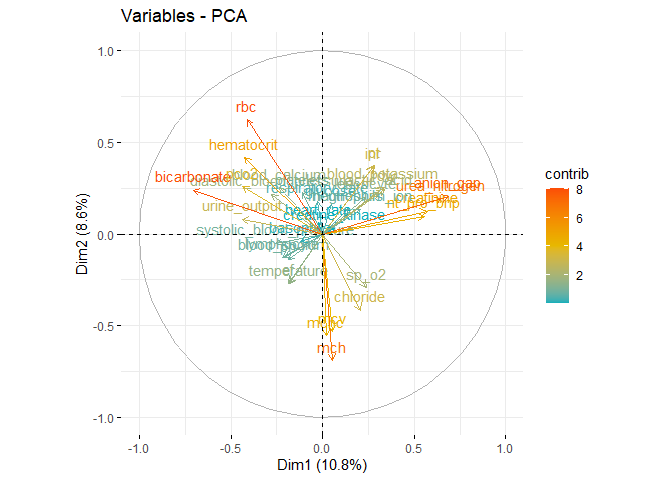<!-- -->

``` r
#based on above results (`var_com$coord`)

corrplot(var_sign$cos2, is.corr=FALSE)
```

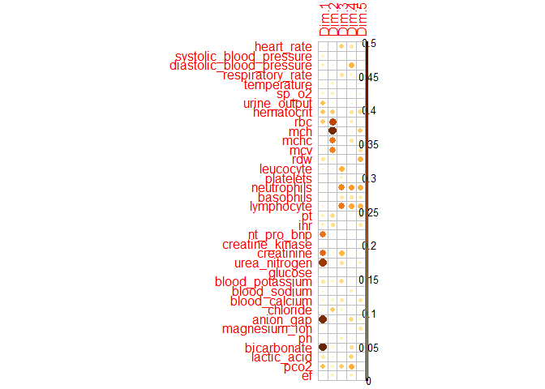<!-- -->

``` r
#shows the quality of variables.

var_sign$contrib
```

    ##                                Dim.1       Dim.2        Dim.3        Dim.4
    ## heart_rate                0.01299803  0.12039099 6.110981e+00 4.512397e+00
    ## systolic_blood_pressure   1.68253645  0.08460949 1.435093e+00 4.881952e-02
    ## diastolic_blood_pressure  1.99169679  1.54072860 9.072668e-03 8.799605e+00
    ## respiratory_rate          0.01966810  1.04575985 4.465515e+00 3.018741e+00
    ## temperature               0.84124369  2.39989801 1.681628e+00 7.693679e-01
    ## sp_o2                     1.48401526  2.75919724 4.038464e-02 1.094641e-01
    ## urine_output              4.92461280  0.21313387 4.876200e-02 1.949906e+00
    ## hematocrit                4.66775651  5.63474745 2.875031e-02 4.877964e+00
    ## rbc                       4.38001753 12.63318090 5.056290e-01 3.892511e+00
    ## mch                       0.07522028 15.46647523 3.028703e-01 1.374175e+00
    ## mchc                      0.01339484  9.95976830 7.886085e-01 4.920090e+00
    ## mcv                       0.07627069  9.27501865 1.459458e+00 2.308745e-02
    ## rdw                       2.93292427  1.93444382 5.635068e-01 1.004939e+00
    ## leucocyte                 1.41813655  1.32214332 8.445047e+00 7.452117e-06
    ## platelets                 0.29807289  1.67200015 3.096490e+00 3.192689e-01
    ## neutrophils               0.52371892  0.62651377 1.108728e+01 1.063998e+01
    ## basophils                 0.36709973  0.05213969 4.083741e+00 5.146555e+00
    ## lymphocyte                1.25536822  0.51798077 1.200649e+01 9.758203e+00
    ## pt                        2.02756531  4.48966606 1.076553e+00 1.633983e-01
    ## inr                       2.00380848  4.38816721 9.578797e-01 1.797938e-01
    ## nt_pro_bnp                7.90489403  0.31036692 5.362263e-01 2.465785e-03
    ## creatine_kinase           0.11501632  0.03205641 7.904897e-01 5.138023e-01
    ## creatinine                8.35869422  0.51277016 7.956729e+00 5.773969e-02
    ## urea_nitrogen            10.91126617  1.19406862 4.637314e+00 7.547438e-01
    ## glucose                   0.06001578  0.85684670 8.771166e-02 2.464370e-02
    ## blood_potassium           2.83339862  2.13285457 5.690550e+00 3.760782e-02
    ## blood_sodium              1.12382896  0.54097415 2.921800e-03 3.745881e+00
    ## blood_calcium             1.43453365  2.06203324 4.035239e+00 2.637540e-01
    ## chloride                  1.11969093  5.62715885 2.504195e+00 1.671457e-01
    ## anion_gap                12.13162687  1.37579167 3.746603e-01 6.223869e+00
    ## magnesium_ion             1.11262140  0.60554376 1.704090e+00 2.742457e-01
    ## ph                        0.92140227  0.62420577 3.418909e+00 1.253606e+00
    ## bicarbonate              12.80341830  1.85172583 2.105968e+00 5.674769e+00
    ## lactic_acid               2.38068678  1.64267871 1.512402e+00 6.546077e+00
    ## pco2                      4.91750215  2.15410570 6.448591e+00 9.191026e+00
    ## ef                        0.87527820  2.34085559 2.700151e-04 3.760349e+00
    ##                               Dim.5
    ## heart_rate               0.17066703
    ## systolic_blood_pressure  2.17913834
    ## diastolic_blood_pressure 0.76283607
    ## respiratory_rate         0.29185910
    ## temperature              0.12965523
    ## sp_o2                    2.31394315
    ## urine_output             0.02627790
    ## hematocrit               6.33908203
    ## rbc                      1.68215703
    ## mch                      7.88287412
    ## mchc                     3.86390193
    ## mcv                      5.52093412
    ## rdw                      9.73646602
    ## leucocyte                1.65434465
    ## platelets                0.01018426
    ## neutrophils              9.97809244
    ## basophils                4.25870286
    ## lymphocyte               9.14980122
    ## pt                       4.91090979
    ## inr                      4.79996681
    ## nt_pro_bnp               0.18222836
    ## creatine_kinase          0.03841478
    ## creatinine               2.21511971
    ## urea_nitrogen            3.64986569
    ## glucose                  1.43000360
    ## blood_potassium          1.02967113
    ## blood_sodium             0.10119640
    ## blood_calcium            4.98461255
    ## chloride                 2.05132600
    ## anion_gap                3.04969011
    ## magnesium_ion            4.70972675
    ## ph                       0.01209208
    ## bicarbonate              0.17404682
    ## lactic_acid              0.30353817
    ## pco2                     0.18776925
    ## ef                       0.21890447

``` r
#shown by contribution

fviz_contrib(res_pca_sign, choice = "var", axes = 1, top = 10)
```

<!-- -->

``` r
fviz_contrib(res_pca_sign, choice = "var", axes = 1:5, top = 10)
```

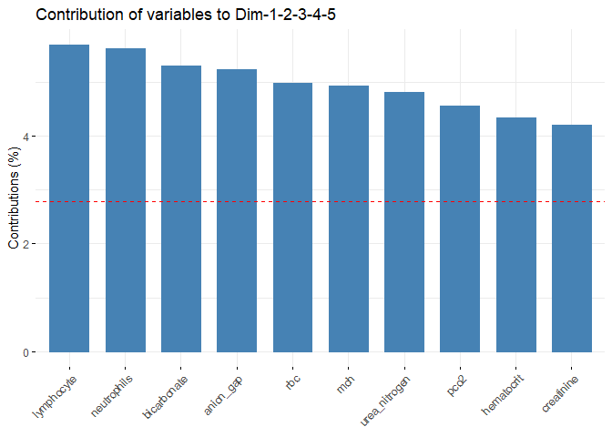<!-- -->
